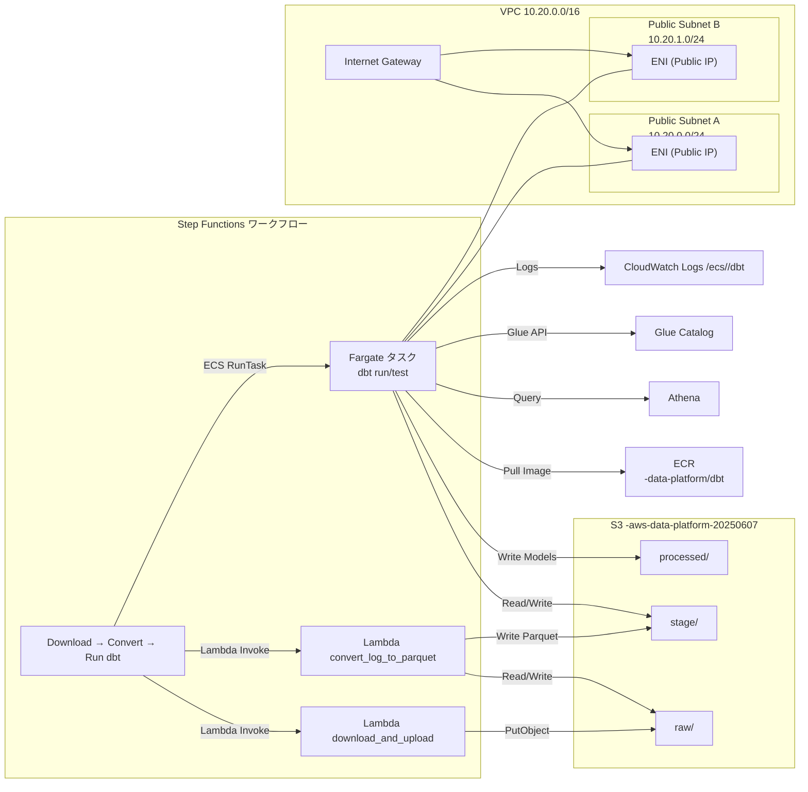

## AWS Architecture Diagram

このドキュメントは、Terraformで管理されているAWSデータ基盤のアーキテクチャをMermaid形式で可視化したものです。

### データフロー概要

1.  **データ収集**:
    - `download_and_upload` Lambda関数が、外部のKaggle APIからmHealthデータセットをダウンロードし、生のログファイルのままS3バケット (`Raw Data Bucket`) にアップロードします。

2.  **ETL (Extract, Transform, Load)**:
    - このプロセス全体は **Step Functions** によってオーキエストレーションされます。
    - Step Functionsはまず `download_and_upload` Lambda を呼び出し、その結果を `convert_log_to_parquet` Lambda へ渡します。
    - 変換後、Step Functions は ECS RunTask を介して **Fargate** 上の dbt タスクを起動し、`dbt run -m cleaned_activities` と `dbt test` を同期実行します。
    - Fargate タスクはパブリックサブネットで Public IP を取得し、ECR からコンテナイメージをプルしたのち S3/Glue/Athena にアクセスします。

3.  **DWH (Data Warehouse)**:
    - **Glue Data Catalog** が、S3上のデータに対するメタデータストアとして機能します。
    - `stage_mhealth` データベースは、Parquet変換後のStagingデータをテーブルとして定義します。
    - `processed_mhealth` データベースは、dbtによって変換された最終的なデータをテーブルとして定義します。
    - これにより、S3上のファイルが直接クエリ可能なテーブルとして扱えるようになります。

4.  **分析**:
    - **Amazon Athena** を使用して、Glue Data Catalogに登録されたテーブルに対して標準SQLでインタラクティブにクエリを実行し、データの分析や可視化を行います。
