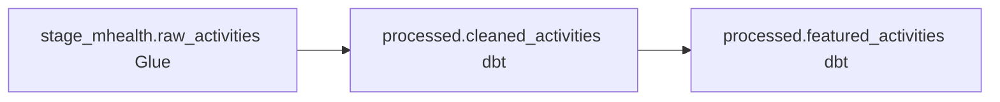

## mHealth ETL フロー図（Mermaid）

本ドキュメントは、本プロジェクトの ETL/分析フローを図で俯瞰できるようにまとめたものです。Mermaid を使用しており、GitHub・VS Code でそのまま表示可能です。

## 全体フロー（データの流れ）

```mermaid
flowchart LR
  subgraph Ingestion
    A[Kaggle mHealth logs]
    L1[Lambda download_and_upload<br/>- mHealth_subject*.log を取得<br/>- S3 raw/ に保存]
    A --> L1 --> R[(S3 raw/)]
  end

  subgraph Staging_ETL_Log_to_Parquet
    L2[Lambda convert_log_to_parquet<br/>- read .log<br/>- schema validate 24 cols<br/>- activity_label=0 除外<br/>- Parquet 変換]
    R --> L2 --> S[(S3 stage/<br/>subject_id=…/activity_label=…/)]
  end

  subgraph Catalog
    G1[Glue Data Catalog<br/>stage_mhealth.raw_activities<br/>- Partition Projection<br/>- subject_id, activity_label]
    S --> G1
  end

  subgraph DBT_Transform
    M1[dbt: cleaned_activities<br/>- $path/partition から user_id 抽出<br/>- 3軸平均: chest/ankle/arm<br/>- activity_label != 0]
    M2[dbt: featured_activities<br/>- user_id×activity_label 集約<br/>- mean/std/min/max]
    G1 --> M1 --> M2
  end

  subgraph Processed
    P[(S3 processed/<br/>cleaned_activities/, featured_activities/)]
    M1 --> P
    M2 --> P
  end

  subgraph Query_and_ML
    Atn[Amazon Athena]
    Nb[Notebook / Lambda train_evaluate.py]
    P --> Atn
    P --> Nb
  end
```



## テーブル系譜（ラインエイジ）



## 補足メモ
- パーティション戦略: `subject_id` × `activity_label`（`activity_label=0` は除外）。S3 の `stage/` に `subject_id=…/activity_label=…/` で配置。
- Partition Projection: Glue テーブル側で規則を定義し、MSCK なしでパーティション解決。S3 の配置自体は Lambda 側で実施。
- cleaned_activities: `$path` または Glue partition から `user_id` を抽出し、3軸平均を算出。
- featured_activities: `user_id × activity_label` 単位に統計量（mean/std/min/max）を集約。
- Notebook/Lambda(train_evaluate.py): `processed` の特徴量を読み込み、学習・評価・メトリクス保存。

```note
VS Code での表示: Markdown プレビュー（Ctrl/Cmd+Shift+V）で Mermaid が表示されます。
GitHub でもそのままプレビュー可能です。
```
