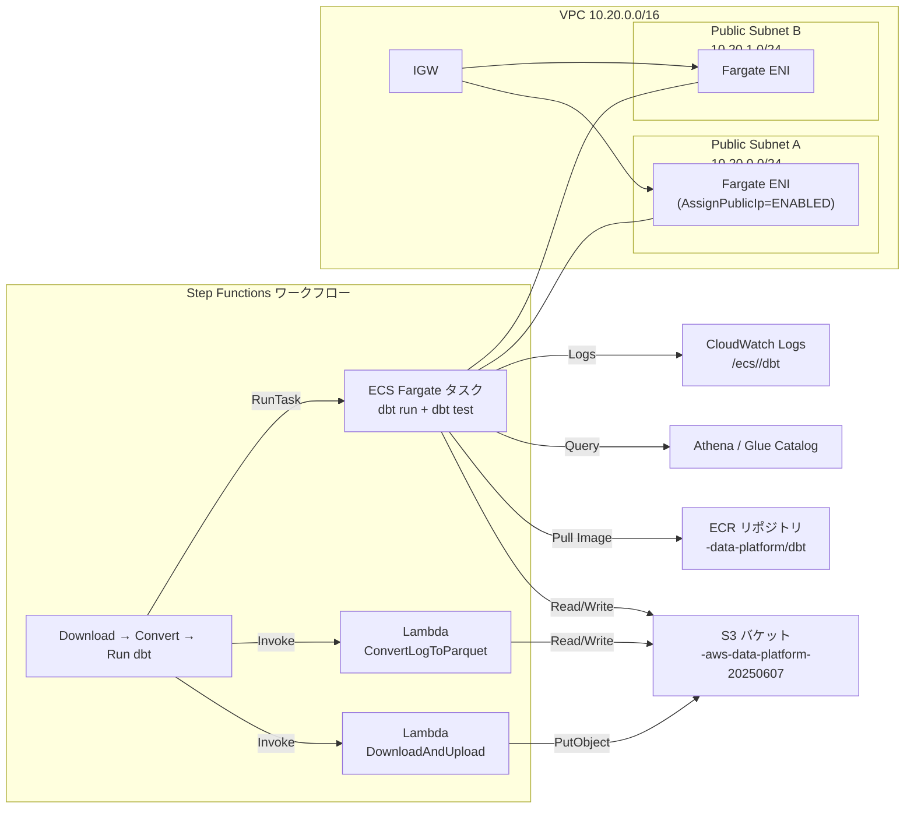

# AWS構成ダイアグラム（dbt on Fargate）

下図は現在の構成差分（NAT Gateway を廃止し、Fargate タスクをパブリックサブネットで稼働）を反映したアーキテクチャ図です。

- Fargate タスクはパブリックサブネット内で起動し、Public IP を付与して ECR / S3 / Athena へ直接アクセスします。
- NAT Gateway やプライベートサブネットは使用していません。
- Step Functions は Lambda 2 本と Fargate タスクを同期実行し、CloudWatch Logs に dbt の実行ログが送られます。

